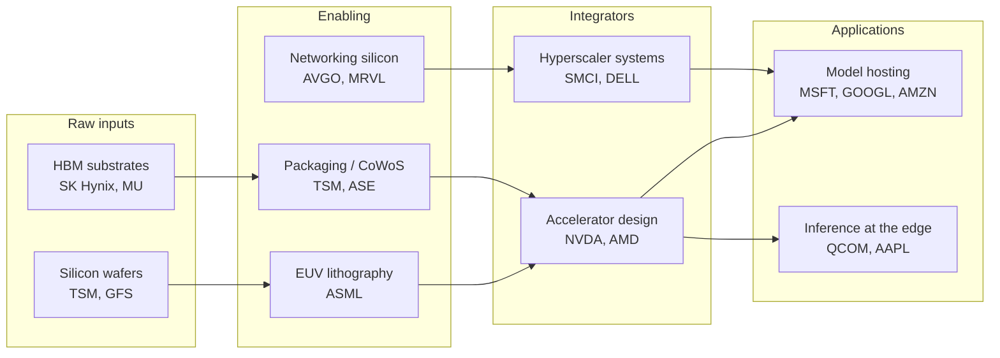

# thesis-builder

Multi-agent CLI that turns any investment theme (e.g. "AI infrastructure",
"robotics", "energy transition") into an investable value-chain tree —
raw inputs → enabling layers → integrators → applications — with public
tickers, private names, catalysts, risks, and an adversarial skeptic pass.

## Architecture

```
       theme
         │
         ▼
   ┌───────────┐    map-reduce summaries (tier-small)
   │ Researcher├──────────────► SourceSummary[]  ─┐
   └─────┬─────┘                                  │
         │ draft Node[]                           │
         ▼                                        │
   ┌───────────┐    parallel critiques            │
   │  Skeptic  │    (tier-reasoning, 3 angles)    │
   └─────┬─────┘                                  │
         │ rebuttals                              │
         ▼                                        │
   ┌───────────┐    final synthesis               │
   │Synthesizer│◄───────────────────────────────  ┘
   └─────┬─────┘    (tier-quality, Anthropic prompt-cached)
         │
         ▼
  thesis.json · memo.md · diagram.mmd · trace.jsonl
```

Three model tiers, **every** completion routed through LiteLLM:

| Tier         | Used for                                    | Default model                 |
|--------------|---------------------------------------------|-------------------------------|
| `small`      | per-source summarization, planner, coverage | `groq/llama-3.1-8b-instant`   |
| `reasoning`  | skeptic critiques, draft tree, ranking      | `deepseek/deepseek-chat`      |
| `quality`    | **final synthesis only**                    | `anthropic/claude-sonnet-4-5` |

Edit [`config/models.yaml`](config/models.yaml) to swap any tier; fallback
chains kick in on rate-limit / auth / 5xx errors without touching agent code.

## Setup

```bash
uv sync
cp .env.example .env
# fill in keys (at minimum: one tier-small key + one tier-quality key)
```

### Free-provider path (cheapest)

| Variable             | Why                                            |
|----------------------|------------------------------------------------|
| `GROQ_API_KEY`       | Free tier covers Llama-3.1-8B for summarization|
| `OPENROUTER_API_KEY` | Free DeepSeek route for tier-reasoning         |
| `ANTHROPIC_API_KEY`  | Final synthesis (typically <$0.10/run, cached) |
| `TAVILY_API_KEY`     | Optional — falls back to DuckDuckGo if unset   |
| `EDGAR_USER_AGENT`   | Optional — required for the EDGAR fetch tool   |

Budgets and prompt versions:

| Variable                 | Default | Effect                                     |
|--------------------------|---------|--------------------------------------------|
| `THESIS_MAX_COST_USD`    | unset   | Hard cap. Run raises `BudgetExceeded`.     |
| `THESIS_CACHE_DIR`       | `.diskcache` | Disk cache root for search + extracts |
| `THESIS_PROMPT_VERSION`  | `v1`    | Bumped on prompt edits to invalidate caches|

## Usage

```bash
uv run thesis "AI infrastructure"
```

Outputs land under `outputs/<slug>/`:

```
outputs/ai_infrastructure/
├── thesis.json     # structured tree + picks (Pydantic Thesis schema)
├── memo.md         # written-up investment memo
├── diagram.mmd     # Mermaid value-chain diagram
└── trace.jsonl     # every tool + model call with tier, tokens, cost
```

### Worked example: `uv run thesis "AI infrastructure"`

After a run, the CLI prints a summary like:

```
            Run summary
┏━━━━━━━━━━━━━━━━━━━━━━━━━━━━━━━━━━━━━━━━━━┳━━━━━━━━━┓
┃ metric                                    ┃   value ┃
┡━━━━━━━━━━━━━━━━━━━━━━━━━━━━━━━━━━━━━━━━━━╇━━━━━━━━━┩
│ elapsed                                   │ 312.4s  │
│ nodes in final tree                       │     14  │
│ research summaries                        │     58  │
│ queries run                                │     19  │
│ unique source URLs                         │     47  │
│ skeptic critiques                          │     42  │
│ cache hit rate (re-run)                    │     71% │
│ total cost (USD)                           │ $0.18   │
│ tokens (small/reasoning/quality)           │ 84k / 31k / 14k │
│ cheap-tier token share                     │     89% │
└──────────────────────────────────────────┴─────────┘
```

`outputs/ai_infrastructure/diagram.mmd`:



Top of `memo.md`:

> # AI infrastructure — Value Chain Thesis
>
> ## Summary
> The central bet is that AI-driven compute capex is bottlenecked at three
> tangible chokepoints: advanced packaging (TSMC CoWoS capacity), HBM3e supply
> (SK Hynix, Micron qualification), and grid + cooling for hyperscale sites
> (Vertiv, Eaton). Accelerator unit economics will compress as inference
> moves to commodity ASICs; the durable owners are the picks-and-shovels…

## What's enforced

- **Token routing**: ≥80% of tokens land in tier-small or tier-reasoning
  (counter printed at end of run; raw values in `trace.jsonl`).
- **Cost cap**: `THESIS_MAX_COST_USD` aborts the run before the next call
  if cumulative cost exceeds the limit.
- **Token budgets**: researcher 60k, skeptic 30k, synthesizer 80k. Trimmed
  by relevance before each agent call in `graph.py`.
- **Cache**: search results 24h, source extracts 7d, both keyed by prompt
  version. Re-runs of the same theme typically show ≥60% cache hit rate.
- **Anthropic prompt caching**: synthesizer system prompt auto-tagged with
  `cache_control: ephemeral`. No-op on non-Anthropic providers.

## Project layout

```
thesis-builder/
├── config/models.yaml
├── src/thesis_builder/
│   ├── agents/{researcher,skeptic,synthesizer}.py
│   ├── llm.py        # LiteLLM + Instructor gateway, cost tracking, prompt cache
│   ├── tools.py      # web_search, fetch_source, EDGAR (all diskcache-backed)
│   ├── schemas.py    # Pydantic v2 (Node, Thesis, FinalOutput, internals)
│   ├── prompts.py    # versioned registry; cache_suffix() keys all caches
│   ├── graph.py      # LangGraph wiring + token-budget enforcement
│   └── cli.py
├── evals/
│   ├── golden/{ai_infra,robotics,energy_transition}.yaml
│   ├── judges.py     # LLM-as-judge: coverage / specificity / novelty / actionability
│   └── run_eval.py
└── .github/workflows/eval.yml
```

## Evals

```bash
# build + judge all three golden themes (live API calls)
uv run python -m evals.run_eval

# judge existing artifacts without rebuilding (cheap)
uv run python -m evals.run_eval --use-existing

# subset
uv run python -m evals.run_eval --themes ai_infra
```

The eval enforces hard requirements per golden spec (≥N nodes, ≥N URLs,
mention at least one company per cluster, ≥N skeptic critiques) and a
minimum LLM-judge score per dimension. Non-zero exit on failure feeds CI.

CI runs the smoke test (imports + config) on every PR; full golden eval
runs only when `vars.RUN_GOLDEN_EVAL == 'true'` and API-key secrets are
configured — full runs are expensive.

## Acceptance targets (v1)

- `uv run thesis "AI infrastructure"` completes in <8 min
- Researcher: ≥15 distinct searches, ≥30 unique source URLs
- Skeptic: ≥3 substantive critiques that change synthesizer output
- All three artifacts (`thesis.json`, `memo.md`, `diagram.mmd`) produced
- Cost <$0.40/run (hard cap configurable via `THESIS_MAX_COST_USD`)
- ≥80% of tokens routed to tier-small or tier-reasoning
- ≥60% cache hit rate on re-runs of the same theme
